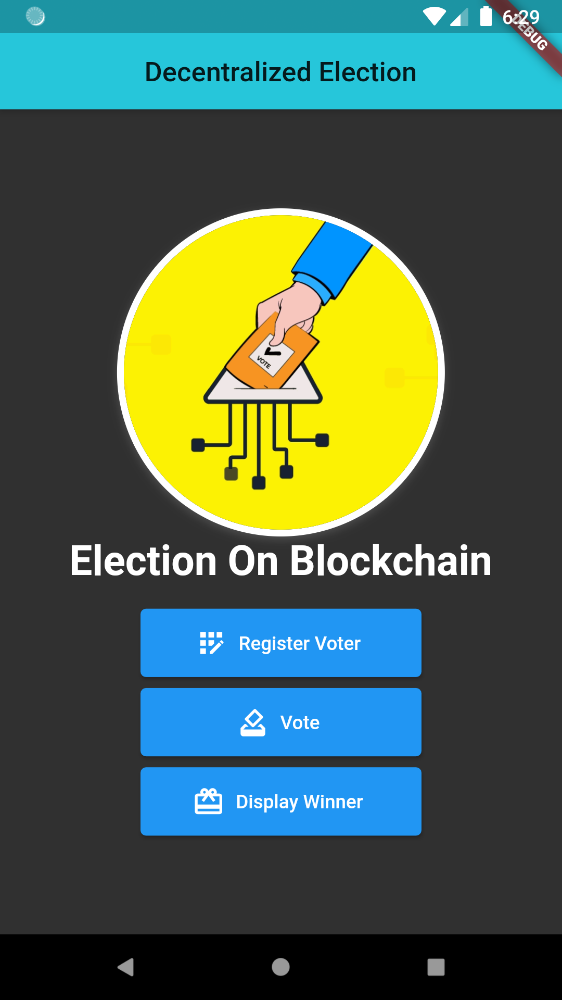
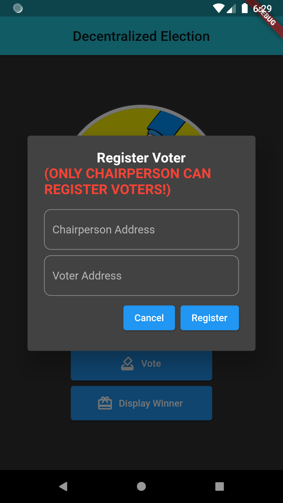
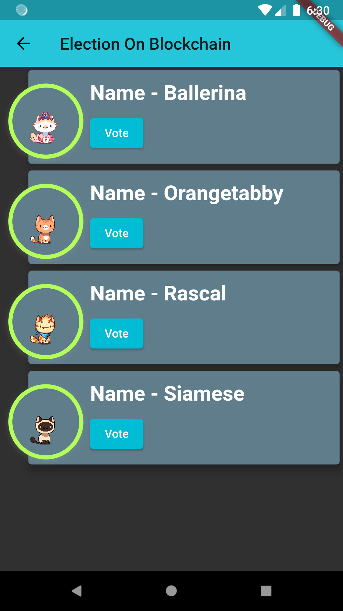
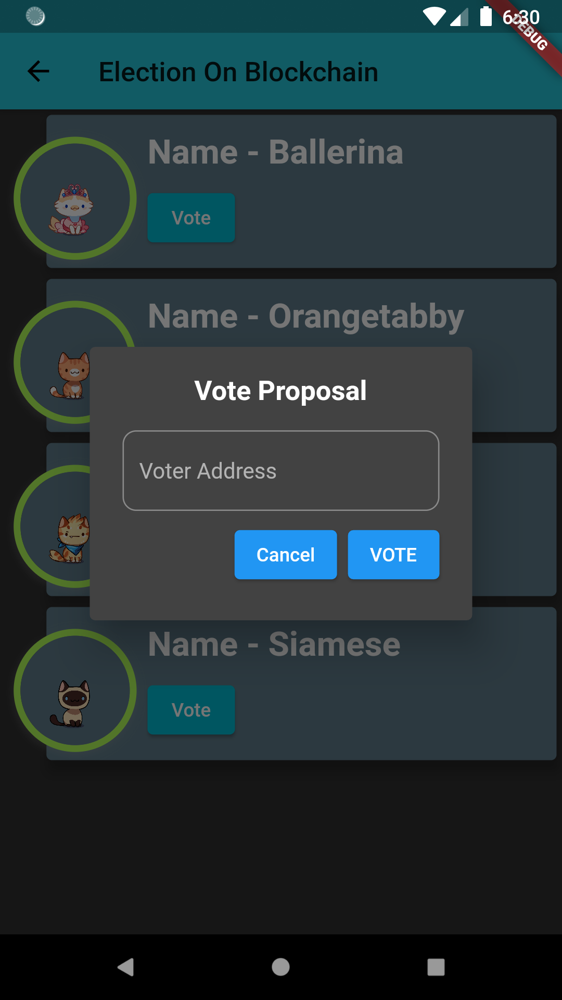
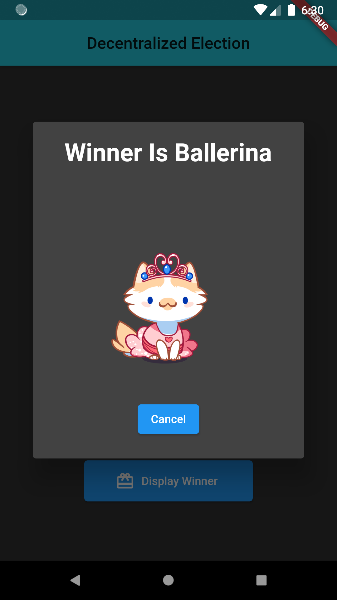

# Elections On Blockchain (Flutter + Blockchain)
## Project 6

A basic blockchain and flutter based project.

## Getting Started

```
📁 elections
    📁 lib
        🎯 contract_linking.dart
          - Update _rpcUrl, _wsUrl, _privateKey as per your needs.
```

You can test it on your local blockchain server via [Ganache](https://www.trufflesuite.com/ganache).
- Add the project in Ganache.
- Run `truffle migrate`

|                                                          |                                                      |
|----------------------------------------------------------|:----------------------------------------------------:|
|      |  |  

|                                                          |                                                      |
|----------------------------------------------------------|:----------------------------------------------------:|
|      |  | 

|                                                                                                               |
|----------------------------------------------------------
|      

- [Lab: Write your first Flutter app](https://flutter.dev/docs/get-started/codelab)
- [Cookbook: Useful Flutter samples](https://flutter.dev/docs/cookbook)

For help getting started with Flutter, view our
[online documentation](https://flutter.dev/docs), which offers tutorials,
samples, guidance on mobile development, and a full API reference.
